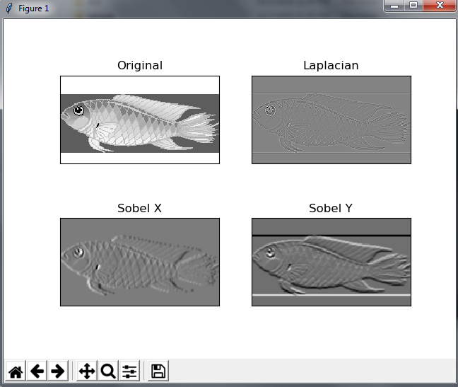
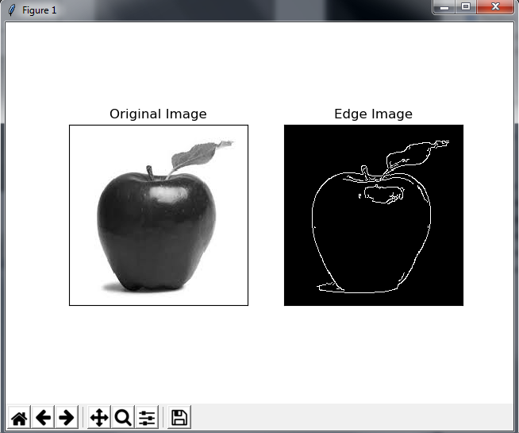

# Image-Video-Processing-Open-CV

1. Tresholding
2. Gradient
3. Blur / Smoothing
4. Histogram 2D
5. Dense Optical Flow
6. Canny Edge

# Source
src/app.py

# Distribution
dist/Image-Video-Processing.7z -> Image-Video-Processing.exe

## Screenshoot

