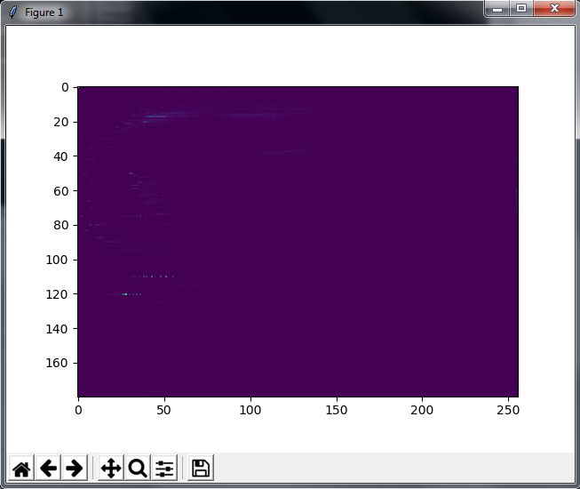

# Image-Video-Processing-Open-CV

v.3.6.2 Python

1. Tresholding (Image)
2. Gradient (Image)
3. Blur / Smoothing (Image)
4. Histogram 2D (Image)
5. Dense Optical Flow (Video)
6. Canny Edge (Image)

# Source
src/app.py

# Distribution
dist/Image-Video-Processing.7z -> Image-Video-Processing.exe

## Screenshoot

## Demo On Youtube
https://www.youtube.com/watch?v=cg0NtAZfAg4 
